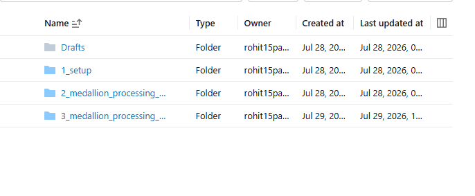
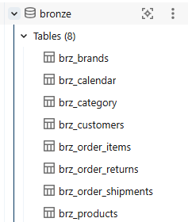
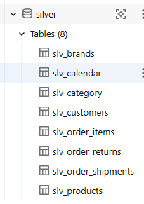
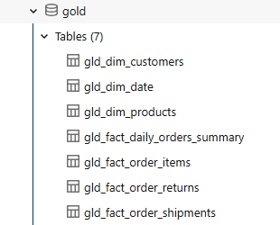
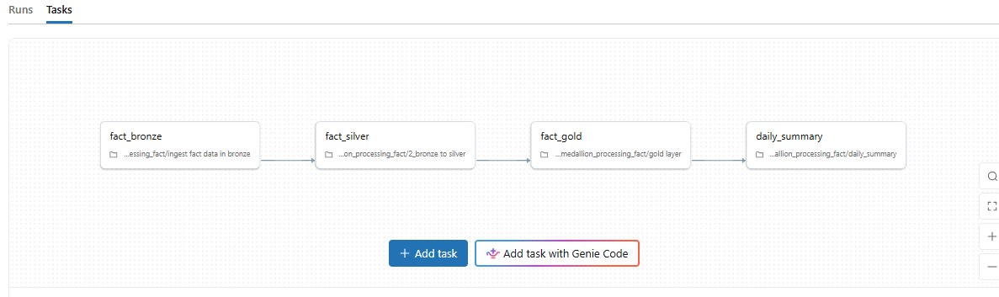
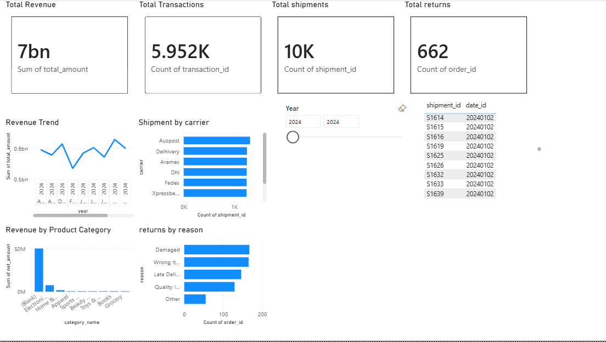

# 🛒 Ecommerce Data Modernization Platform

### End-to-End Azure Databricks Data Engineering Pipeline using Medallion Architecture


## 📌 Project Overview

This project demonstrates the design and implementation of an end-to-end modern data engineering platform for an e-commerce business using Microsoft Azure and Azure Databricks.

The pipeline ingests raw operational data from multiple business domains, including Orders, Order Items, Shipments, and Returns, and processes it through a Medallion Architecture (Bronze, Silver, and Gold) to create analytics-ready datasets.

The solution leverages Delta Lake, Auto Loader, Structured Streaming, Change Data Feed (CDF), and MERGE operations to support incremental data processing while maintaining data quality and consistency.

The final Gold layer produces business-ready fact and dimension tables, along with daily summary tables that can be directly consumed by reporting tools such as Power BI.


## 🎯 Business Problem

E-commerce platforms continuously generate transactional data from multiple operational systems.

Without a structured data engineering pipeline:

- Data arrives in different formats.
- Duplicate records may occur.
- Business reports become inconsistent.
- Incremental updates become difficult.
- Analytics teams spend significant time cleaning raw data.

The objective of this project is to build a scalable modern data platform capable of ingesting, transforming, and serving trusted business data for reporting and analytics.


## 💡 Solution

This project implements a complete Medallion Architecture using Azure Databricks.

The pipeline:

- Continuously ingests new files using Auto Loader.
- Stores raw data in the Bronze layer.
- Cleans and standardizes data in the Silver layer.
- Creates analytics-ready fact and dimension tables in the Gold layer.
- Generates daily business summaries for reporting.
- Orchestrates the complete workflow using Databricks Jobs.

- ## 🛠️ Technology Stack

| Category | Technology |
|----------|------------|
| Cloud Platform | Microsoft Azure |
| Data Processing | Azure Databricks |
| Storage | Azure Data Lake Storage Gen2 (ADLS Gen2) |
| Processing Engine | Apache Spark (PySpark) |
| Data Format | Delta Lake |
| Data Ingestion | Auto Loader |
| Streaming | Structured Streaming |
| Incremental Processing | Change Data Feed (CDF), MERGE |
| Workflow Orchestration | Databricks Workflows |
| Catalog | Unity Catalog |
| Programming Languages | Python, SQL |
| Reporting | Power BI  |

## 🏗️ Project Architecture

```text
                Raw CSV Files
                      │
                      ▼
          Azure Data Lake Storage (Landing)
                      │
                 Auto Loader
                      │
                      ▼
          ┌──────────────────────┐
          │      Bronze Layer    │
          │ (Raw Streaming Data) │
          └──────────────────────┘
                      │
             Structured Streaming
                      │
                      ▼
          ┌──────────────────────┐
          │      Silver Layer    │
          │ Data Cleaning &      │
          │ Standardization      │
          └──────────────────────┘
                      │
          Change Data Feed (CDF)
                 + MERGE
                      │
                      ▼
          ┌──────────────────────┐
          │       Gold Layer     │
          │ Fact & Dimension     │
          │ Tables               │
          └──────────────────────┘
                      │
                      ▼
              Daily Summary Tables
                      │
                      ▼
               Power BI Dashboard
```

## 🔄 Data Pipeline

The project follows the Medallion Architecture and processes multiple business entities through incremental streaming pipelines.

### Bronze Layer
- Ingests raw CSV files using Auto Loader.
- Stores raw transactional data.
- Maintains ingestion metadata.
- Supports incremental file processing using checkpoints.

### Silver Layer
- Cleans and validates incoming records.
- Removes duplicates.
- Standardizes schema.
- Applies business transformations.
- Enables Change Data Feed (CDF).

### Gold Layer
- Creates business-ready Fact and Dimension tables.
- Uses MERGE for incremental upserts.
- Generates Daily Summary tables.
- Serves reporting and analytics workloads.

## 📂 Project Structure

```
ecommerce-data-modernization/
│
├── notebooks/
│   ├── medallion_processing_dim/
│   │   ├── bronze.py
│   │   ├── silver.py
│   │   └── gold.py
│   │
│   └── medallion_processing_fact/
│       ├── bronze.py
│       ├── silver.py
│       ├── gold.py
│       └── daily_summary.py
│
├── architecture/
│
├── screenshots/
│
├── docs/
│
├── README.md
│
└── .gitignore
```


## ✨ Key Features

- End-to-End Medallion Architecture
- Incremental Data Ingestion using Auto Loader
- Structured Streaming Pipelines
- Delta Lake Storage
- Change Data Feed (CDF)
- Incremental Upserts using MERGE
- Bronze, Silver and Gold Layer Processing
- Unity Catalog Integration
- Databricks Workflows for Orchestration
- Daily Business Summary Generation
- Power BI Ready Gold Tables

## 📦 Business Entities Processed

The pipeline processes multiple business datasets:

- Customers
- Products
- Orders
- Order Items
- Shipments
- Returns

These datasets are transformed into analytics-ready Fact and Dimension tables following the Medallion Architecture.


## 📷 Project Screenshots

### Azure Databricks Workspace

<details>
<summary>📷  Databricks Workspace  Screenshot</summary>



</details>

---

### Bronze Layer

<details>
<summary>📷 Bronze Layer Screenshot</summary>



</details>

---

### Silver Layer

<details>
<summary>📷 Silver Layer Screenshot</summary>



</details>

---

### Gold Layer

<details>
<summary>📷 Gold Layer Screenshot</summary>



</details>

---

### Databricks Workflow

<details>
<summary>📷 Workflow Screenshot</summary>



</details>

---

### Power BI Dashboard

## 📊 Dashboard Preview




## 🚀 Future Enhancements

- Real-time Event Streaming using Apache Kafka
- CI/CD Deployment using Azure DevOps
- Data Quality Validation with Great Expectations
- Automated Monitoring & Alerting
- Advanced Power BI Dashboards
- Data Lineage Integration

- ## 👨‍💻 Author

**Rohit Patwal**

Master of Computer Applications (MCA)

Aspiring Data Engineer

Feel free to connect with me on LinkedIn.
